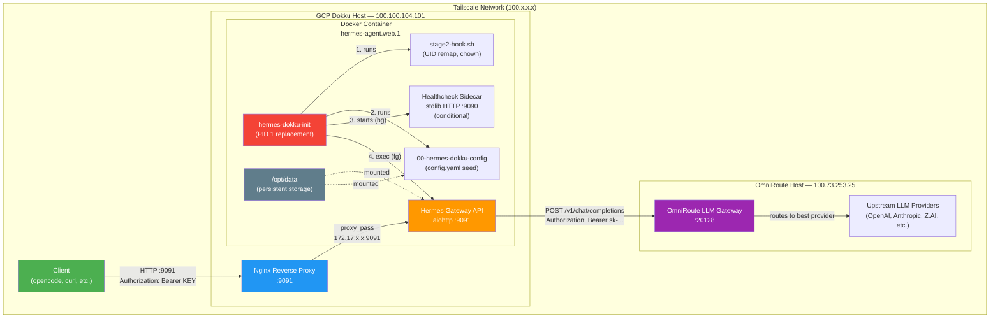
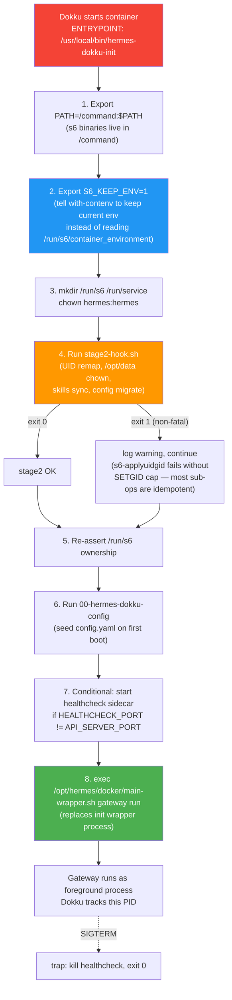
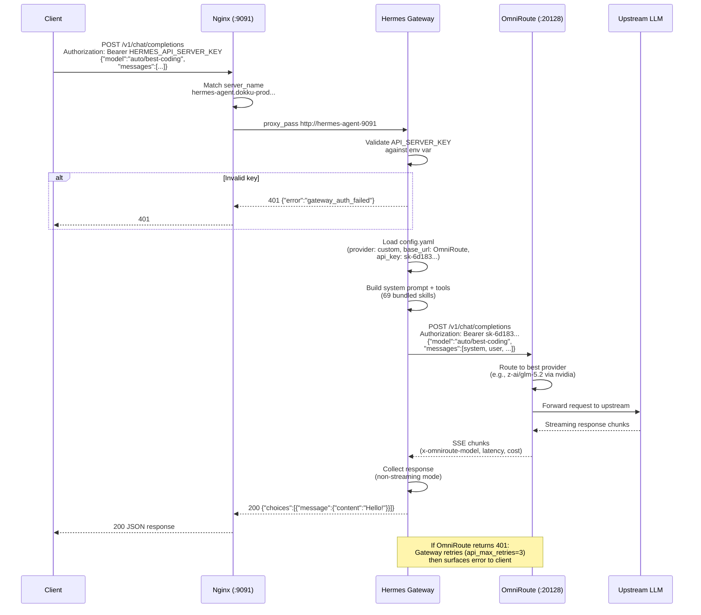
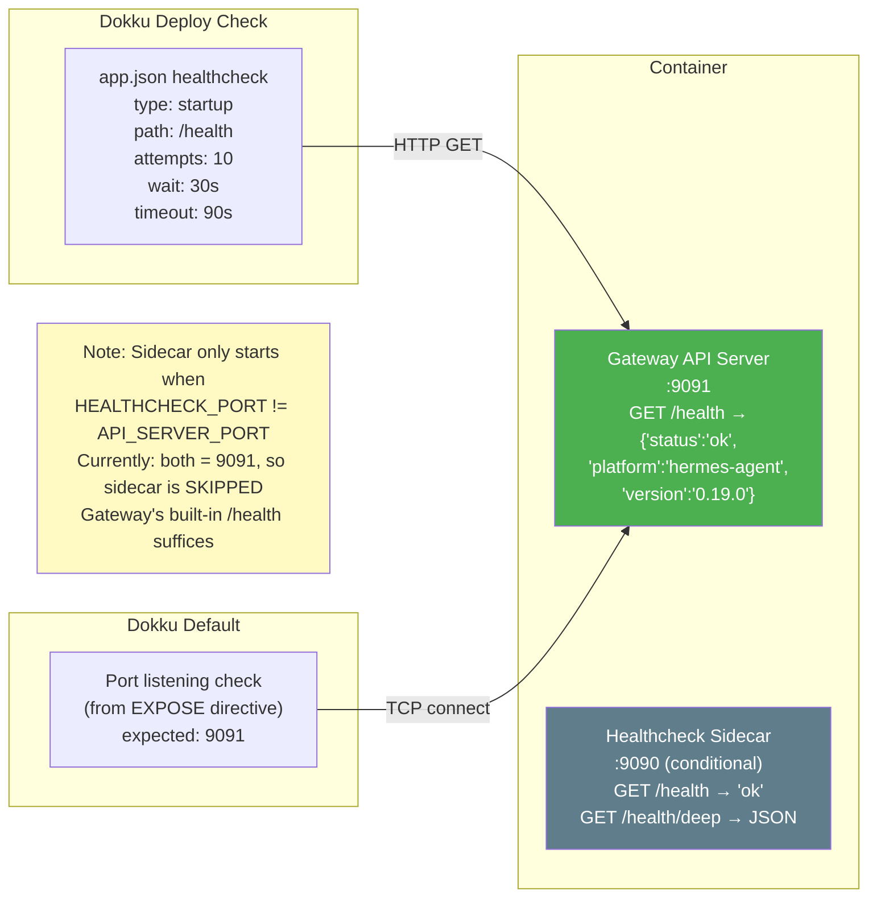
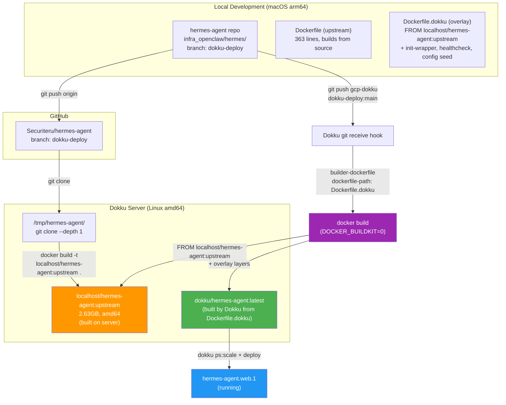
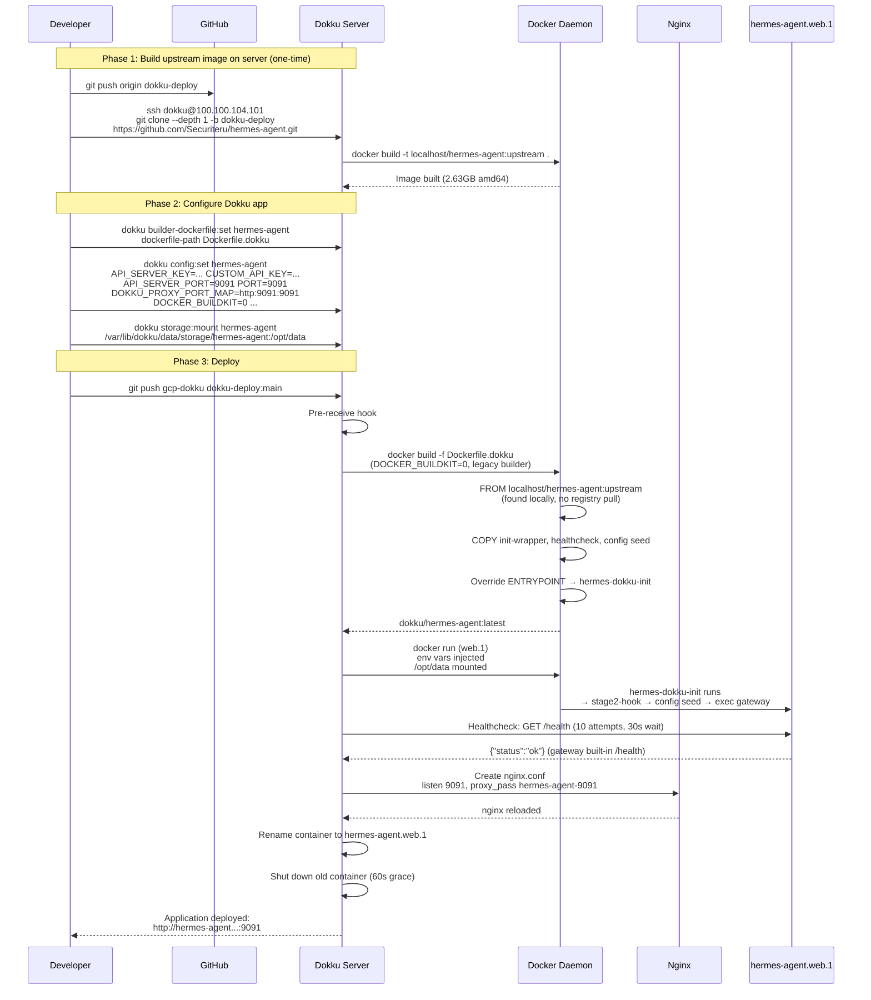
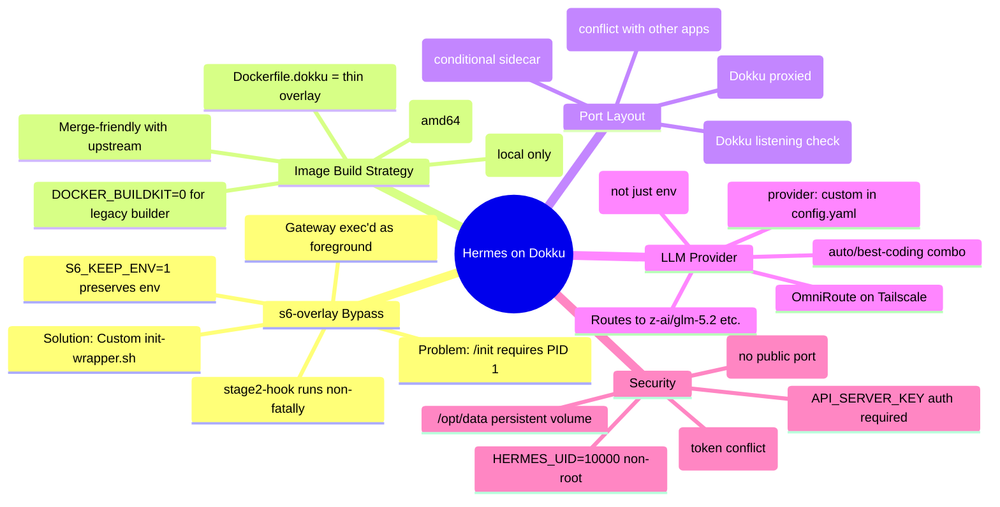

# Hermes Agent — Dokku Deployment Architecture

> **Status:** Production-deployed (2026-07-27)
> **Location:** GCP Dokku instance `100.100.104.101` (Tailscale internal-only)
> **Endpoint:** `http://100.100.104.101:9091` (Tailscale network only)
> **Fork:** [Securiteru/hermes-agent](https://github.com/Securiteru/hermes-agent) @ `dokku-deploy`

---

## 1. System Overview

Hermes Agent (by Nous Research) is deployed as a Docker container on a Dokku
host running on GCP. The container exposes an OpenAI-compatible API server
that proxies LLM requests through OmniRoute (a self-hosted LLM gateway). All
access is restricted to the Tailscale internal network.



---

## 2. Container Process Model

The upstream Hermes image uses **s6-overlay** with `ENTRYPOINT ["/init", ...]`
which requires PID 1. Dokku's process supervisor runs the ENTRYPOINT as a child
process, causing `s6-overlay-suexec: fatal: can only run as pid 1`.

The solution is a **custom init wrapper** (`dokku/init-wrapper.sh`) that
replaces s6-overlay's `/init` and manually performs the initialization steps
that `/init` would have done.



---

## 3. Request Flow — Chat Completion



---

## 4. Health Check Flow



---

## 5. Network Topology

```mermaid
graph LR
    subgraph "Internet"
        Internet((Internet))
    end

    subgraph "Tailscale Mesh VPN"
        subgraph "Developer Machine"
            DevClient["Dev Machine<br/>100.x.x.x"]
        end

        subgraph "GCP Instance (agent-helper)"
            DokkuHost["Dokku Host<br/>100.100.104.101"]

            subgraph "Docker Bridge Network (172.17.0.0/16)"
                HermesContainer["hermes-agent.web.1<br/>172.17.0.x:9091"]
                OtherContainers["Other Dokku apps<br/>(backend-api, error-relay, etc.)"]
            end

            NginxProc["Nginx<br/>0.0.0.0:9091<br/>0.0.0.0:5000<br/>0.0.0.0:8080"]
        end

        subgraph "OmniRoute Host"
            OmniRouteHost["OmniRoute<br/>100.73.253.25:20128<br/>(standalone Docker, NOT Dokku)"]
        end
    end

    Internet -.->|"blocked<br/>(no public port)"| DokkuHost

    DevClient -->|"HTTP :9091"| DokkuHost
    DokkuHost --> NginxProc
    NginxProc -->|"upstream"| HermesContainer

    HermesContainer -->|"HTTP :20128<br/>(Tailscale)"| OmniRouteHost
    OmniRouteHost -->|"HTTPS"| Internet

    style DevClient fill:#4CAF50,color:#fff
    style DokkuHost fill:#2196F3,color:#fff
    style HermesContainer fill:#FF9800,color:#fff
    style OmniRouteHost fill:#9C27B0,color:#fff
    style Internet fill:#F44336,color:#fff
```

---

## 6. Docker Image Build Pipeline



---

## 7. Configuration & Secrets Flow

```mermaid
flowchart TB
    subgraph "Secrets (psst)"
        PsstHermesKey["HERMES_API_SERVER_KEY<br/>(gateway auth)"]
        PsstOmniKey["OMNIROUTE_API_KEY<br/>(LLM provider)"]
        PsstTelegram["TELEGRAM_BOT_TOKEN<br/>(currently unset)"]
    end

    subgraph "Dokku Config (dokku config:set)"
        EnvAPIKey["API_SERVER_KEY=28f96d..."]
        EnvCustomKey["CUSTOM_API_KEY=sk-6d183..."]
        EnvLLMKey["LLM_API_KEY=sk-6d183..."]
        EnvOpenAIKey["OPENAI_API_KEY=sk-6d183..."]
        EnvPort["API_SERVER_PORT=9091"]
        EnvHost["API_SERVER_HOST=0.0.0.0"]
        EnvUID["HERMES_UID=10000"]
        EnvGID["HERMES_GID=10000"]
        EnvDisableLazy["HERMES_DISABLE_LAZY_INSTALLS=1"]
        EnvPlatforms["GATEWAY_PLATFORMS=api_server"]
        EnvBuildKit["DOCKER_BUILDKIT=0"]
        EnvProxy["DOKKU_PROXY_PORT_MAP=http:9091:9091"]
        EnvPortVar["PORT=9091"]
    end

    subgraph "Persistent Volume (/opt/data)"
        ConfigYaml["config.yaml<br/>provider: custom<br/>base_url: http://100.73.253.25:20128/v1<br/>api_key: sk-6d183...<br/>default: auto/best-coding<br/>custom_providers: [omniroute entry]"]
        Sessions["sessions/<br/>(SQLite state.db, response_store.db)"]
        Skills["skills/<br/>(69 bundled)"]
        CronDB["cron/executions.db"]
    end

    subgraph "Dokku Storage Mount"
        Storage["/var/lib/dokku/data/storage/hermes-agent<br/>→ /opt/data<br/>(chown 10000:10000)"]
    end

    PsstHermesKey -.->|"psst set"| EnvAPIKey
    PsstOmniKey -.->|"psst set"| EnvCustomKey
    PsstOmniKey -.->|"psst set"| EnvLLMKey
    PsstOmniKey -.->|"psst set"| EnvOpenAIKey

    EnvAPIKey -.->|"injected at runtime"| ContainerEnv["Container Environment"]
    EnvCustomKey -.-> ContainerEnv
    EnvPort -.-> ContainerEnv

    Storage -->|"mount"| Volume["/opt/data (in container)"]
    Volume --> ConfigYaml
    Volume --> Sessions
    Volume --> Skills
    Volume --> CronDB

    ConfigYaml -->|"read by gateway"| Gateway["Hermes Gateway"]
    ContainerEnv --> Gateway

    style PsstHermesKey fill:#F44336,color:#fff
    style PsstOmniKey fill:#F44336,color:#fff
    style ConfigYaml fill:#FF9800,color:#fff
    style Storage fill:#607D8B,color:#fff
    style Gateway fill:#4CAF50,color:#fff
```



---

## 8. Deployment Sequence



---

## 9. Key Design Decisions



---

## 10. File Structure (Dokku Overlay)

```
hermes-agent/                          # Securiteru fork, branch: dokku-deploy
├── Dockerfile                         # Upstream (363 lines, unchanged)
├── Dockerfile.dokku                   # Dokku overlay (FROM upstream image)
├── Procfile                           # web: /opt/hermes/docker/main-wrapper.sh gateway run
├── app.json                           # Dokku healthchecks (startup /health)
├── .env.dokku.example                 # Env var schema (no secrets)
└── dokku/
    ├── init-wrapper.sh                # Custom PID-1 replacement (bypasses s6 /init)
    ├── healthcheck.py                 # Stdlib HTTP sidecar (/health, /health/deep)
    ├── 00-hermes-dokku-config         # First-boot config.yaml seed (cont-init.d)
    ├── UPGRADE.md                     # How to sync with upstream
    └── s6-rc.d/                       # (reference only, not used)
```

---

## 11. Verification Commands

```bash
# Health check (from Tailscale)
curl -sS http://100.100.104.101:9091/health
# → {"status":"ok","platform":"hermes-agent","version":"0.19.0"}

# List models (authenticated)
psst HERMES_API_SERVER_KEY -- bash -c \
  'curl -sS http://100.100.104.101:9091/v1/models \
   -H "Authorization: Bearer $HERMES_API_SERVER_KEY"'
# → {"object":"list","data":[{"id":"hermes-agent",...}]}

# Chat completion (authenticated)
psst HERMES_API_SERVER_KEY -- bash -c \
  'curl -sS http://100.100.104.101:9091/v1/chat/completions \
   -H "Authorization: Bearer $HERMES_API_SERVER_KEY" \
   -H "Content-Type: application/json" \
   -d "{\"model\":\"auto/best-coding\",\"messages\":[{\"role\":\"user\",\"content\":\"Say hello\"}],\"max_tokens\":10}"'
# → {"choices":[{"message":{"content":"Hello!"}}]}

# Container status
ssh dokku@100.100.104.101 "dokku ps:report hermes-agent"

# View logs
ssh dokku@100.100.104.101 "dokku logs hermes-agent -t"

# Restart
ssh dokku@100.100.104.101 "dokku ps:restart hermes-agent"

# Rebuild upstream image on server (after upstream changes)
ssh dokku@100.100.104.101 "cd /tmp/hermes-agent && git pull && docker build -t localhost/hermes-agent:upstream ."

# Redeploy (after pushing to dokku-deploy branch)
cd infra_openclaw/hermes && git push gcp-dokku dokku-deploy:main
```

---

## 12. Known Limitations & Future Work

| Item | Status | Notes |
|------|--------|-------|
| Telegram gateway | Disabled | `TELEGRAM_BOT_TOKEN` unset due to conflict with another bot instance. Re-enable with a dedicated token. |
| cAdvisor | Stopped | Was blocking nginx port 8080. Restart with `docker start cadvisor`. |
| SQLite WAL | Warning | Linked SQLite 3.46.1 has WAL-reset bug; using `journal_mode=DELETE`. Upgrade to 3.51.3+ via `hermes update`. |
| Terminal backend | Local (unsandboxed) | Gateway runs with full host terminal/file access. Consider `terminal.backend: docker` for sandboxing. |
| Image registry | None | Upstream image built locally on server. Consider pushing to GHCR for reproducibility. |
| HTTPS/TLS | None | Internal Tailscale only. Add Let's Encrypt if external access needed. |
| gbrain page | TODO | Capture reference page at `scenextras/hermes-agent-dokku-deploy`. |
